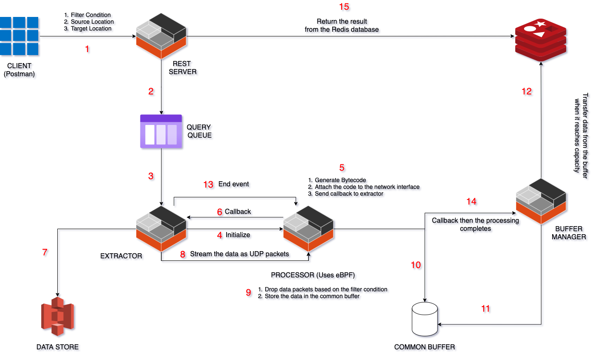

# Efficient Data Processing Using eBPF

## Abstract
Large scale data processing engines such as spark have pipelines built to process data majorly at the application level. Our project aims at implementing this functionality of data processing at the network layer instead of application layer. We can achieve this by injecting rules using eBPF at the XDP layer (which is at the kernel level) even before the data packets are passed to the application layer.

## Project Members 
Swaminathan Sriram, Sreeram Ganesan, Gopala Krishna Vasanth Kanugo

## Software and hardware components:
- XDP 
- eBPF
- VM instances
- API interface: queries that are to be performed on the data.
- Database / S3 : to store data
- Message marshaling and encoding

## Architecture Diagram 
  
